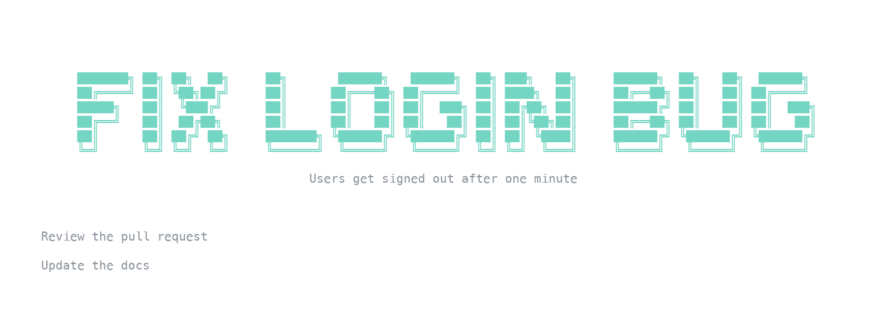

# next-step

A tiny terminal app that keeps your next step in sight.



Long to-do lists make it hard to begin. next-step puts the step you should do now front and center, in big letters. The rest wait quietly underneath. Finish one and the next moves up.

## Install

You need [Bun](https://bun.sh). Then run:

```sh
git clone https://github.com/fayez-nazzal/next-step.git
cd next-step
bun install
bun run install:local
```

This puts the `next-step` command in `~/.local/bin`. If your terminal cannot find it, add that folder to your PATH. Tested on Linux.

## Use

Open a terminal in any folder and run:

```sh
next-step
```

Leave it open in a corner of your screen while you work. Press `a` to add your first step. The first step in the list is the big one, and new steps join the end.

Most keys act on the selected step, and the first step starts out selected.

| Key        | What it does                                              |
| ---------- | --------------------------------------------------------- |
| `a`        | Add a step                                                |
| `j` or `↓` | Select the next step                                      |
| `k` or `↑` | Select the previous step                                  |
| `u`        | Edit the title                                            |
| `d`        | Add or edit a description                                 |
| `c`        | Finish the step                                           |
| `x`        | Delete the step                                           |
| `Space`    | Edit the selected step, or add one if nothing is selected |
| `Esc`      | Clear the selection                                       |
| `Ctrl+C`   | Quit                                                      |

While typing, press `Enter` to save or `Esc` to cancel.

The active title uses OpenTUI's `block` banner when it fits and the compact, four-row `tiny` banner in smaller windows. Long titles and characters the banner fonts cannot display use normal bold text instead, so nothing is clipped or left blank. Descriptions and queued steps stay in normal terminal text.

## Where your steps are saved

Steps live in `.next-step/state.yml` inside the folder where you started the app. Each folder has its own list, so every project can have its own steps.

If that folder is a Git repository, next-step asks Git to ignore the file on your machine, so it does not show up as a change.

Finished and deleted steps are removed for good. There is no history.

## Development

```sh
bun install
bun run check
```

`bun run check` runs every check and builds the app. Use `bun start` to run it straight from the source code.

Bun automatically applies `patches/@opentui%2Fcore@0.5.14.patch` during installation. It rebuilds the compact font on a seven-pixel-high grid, packed into four terminal rows with half-block characters. All letters share a cap line and baseline; middle strokes, including those in `E`, `H`, and `S`, sit on the true center row. Most letters are five columns wide, with narrower `I`, `J`, and `L`, so longer titles may fall back to native text sooner. Digits and punctuation use the same grid. The large banner font is unchanged.
